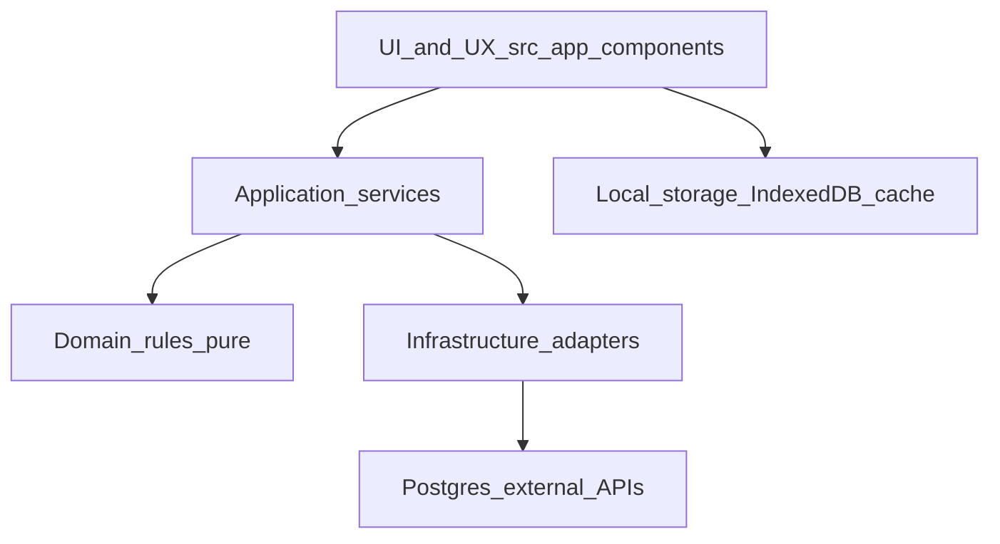
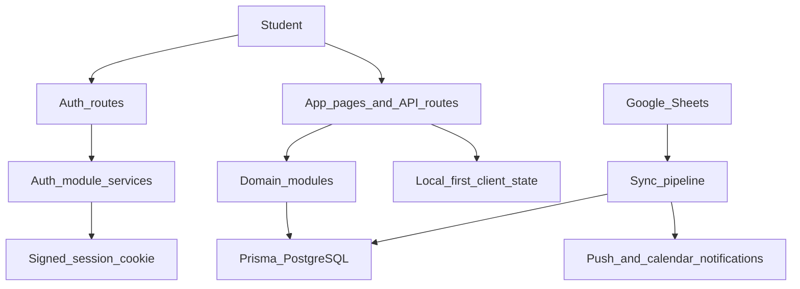

# Architecture

Produktive Buddy is a Next.js App Router application with PostgreSQL (Prisma),
designed around thin routes, explicit domain services, and local-first
personalization.

## Layer Model

## Folder Responsibilities

- `src/app`
  - Page routes and API route handlers.
  - Route handlers perform request parsing, authz checks, and service calls.
  - No route-specific business rules should remain in handlers after refactors.
- `src/components`
  - Reusable presentation and client interaction components.
  - No direct DB or server-infra imports.
- `src/features`
  - Legacy domain services and policy modules under migration to `src/modules`.
  - Keep these framework-agnostic and testable.
- `src/modules`
  - Target home for domain-first modules (`auth`, `calendar`, `onboarding`, etc.).
  - Organize by `application`, `domain`, and `infrastructure` subfolders.
- `src/server`
  - Cross-cutting server concerns (security, audit, observability).
- `src/lib`
  - Stable shared utilities and adapters; avoid route/UI coupling.
- `prisma`
  - Schema, seeds, and catalog fixtures.
- `docs`
  - Runbooks, architecture contracts, and security/privacy policy.

## Primary Runtime Flows

## Data Domain Highlights

- Institution hierarchy: `College`, `Program`, `Batch`, `Term`.
- Source lineage and sync: `SheetSource`, `TermSheetSource`, `SyncSnapshot`, `ChangeEvent`.
- Student profile and onboarding: `User`, `UserTermProfile`, `Enrollment`.
- Personal planning: `Attendance`, `SessionNote`, course color preferences.
- Collaboration: `Friendship`, `Group`, `GroupMember`, `CalendarShare`.
- Governance: `AuditLog` for sensitive state transitions.

## Enforced Guardrails

- Layering constraints are linted in `eslint.config.mjs` via `no-restricted-imports`.
- Cookie-authenticated mutating APIs must enforce same-origin checks.
- Keep route handlers thin; business behavior belongs in services/modules.
- Prefer local-first storage for personal planning state, with server persistence
  only where collaboration/security/analytics value exists.
