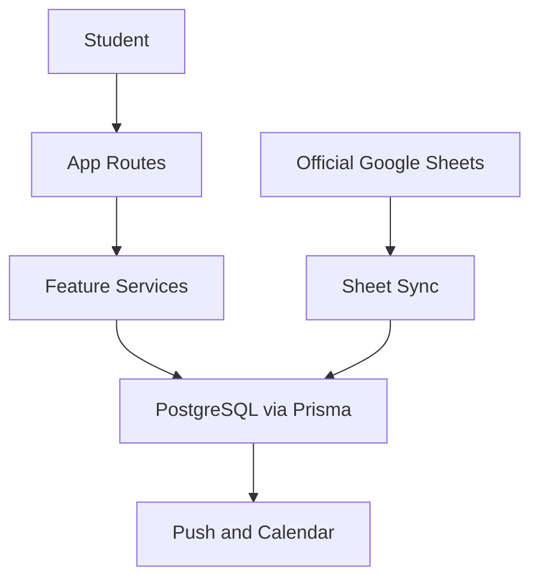

# Architecture

Kairo is a Next.js App Router application backed by PostgreSQL through Prisma.

## Boundaries

- `src/app`: route handlers and pages.
- `src/features`: business logic that should be unit/integration tested.
- `src/server`: cross-cutting server concerns such as security and audit logging.
- `src/components`: reusable UI.
- `src/lib`: stable utilities, adapters, and legacy compatibility modules.

## Core Flows

## Data Model Highlights

- Institution hierarchy: College, Program, Batch, Term.
- Source of truth: SheetSource and TermSheetSource.
- Personalization: User, Enrollment, UserTermProfile, UserCoursePreference.
- Attendance: student self-tracking and future official attendance are separate.
- Social: Friendship, Group, GroupMember.
- Governance: AuditLog records sensitive mutations.
